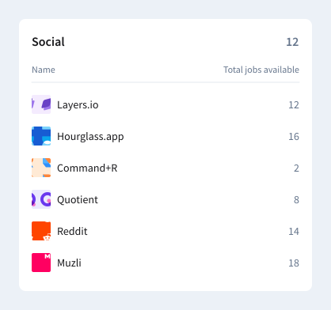

# Dealroom Test Front-End

Welcome to the **Dealroom Test Front-End** repository! This project showcases the implementation of a technical assignment for the Fullstack Engineer position at Dealroom.

## Table of Contents

- [Project Overview](#project-overview)
- [Task Description](#task-description)
- [Tech Stack](#tech-stack)
- [Setup](#setup)
- [Start](#start)

---

## Project Overview

This repository contains the front-end code for a homework assignment completed as part of the interview process for the Fullstack Engineer position at Dealroom. The project focuses on implementing a React.js-based frontend application, which consumes a Node.js API to display and categorize company data.

The backend API implementation for this project can be found in the [dealroom-test-be](https://github.com/prikhoda-natalia/dealroom-test-be) repository.

## Task Description

The assignment included two main parts: backend API implementation and frontend development.

### Backend API Implementation

- Develop an endpoint to retrieve the companies' data provided in `data.json`.
- Push the code to a GitHub repository.

### Frontend Implementation

- Fetch the companies' data from the API created in the backend task.
- Categorize the companies by their respective industries. For each industry, render a card displaying the list of companies belonging to that industry, sorted in alphabetical order.
- The card's title should be the industry name.
- Display the count of companies in that industry at the top right corner of the card.
- Implement the company grouping logic by industry on the frontend, optimized for scalability with large datasets.
- Use [Tailwind CSS](https://tailwindcss.com/) for card design, following the specifications in the [Figma file](https://www.figma.com/design/9GvGhDV1Te6bQzS1GLoj8J/Dealroom-FE-Assessment?node-id=0%3A1&t=I6Ph4vb2EAvbkQQ7-1).



---

## Tech Stack

- **Framework**: React.js
- **Languages**: TypeScript, JavaScript, HTML, CSS
- **State Management**: Redux.js
- **Build Tools**: Webpack
- **Styling**: Tailwind CSS

## Setup

Follow these steps to set up the project locally:

1. **Clone the Repository**:

   ```bash
   git clone https://github.com/prikhoda-natalia/dealroom-test-fe.git
   cd dealroom-test-fe
   ```

2. **Install Dependencies**:

   ```bash
   yarn install
   ```

## Start

**Note:** Ensure the backend repository [dealroom-test-be](https://github.com/prikhoda-natalia/dealroom-test-be) is running before starting this front-end application, so the app can fetch data correctly

1. **Start the Development Server**:

   ```bash
   yarn start
   ```

2. **Open the App**: Visit [http://localhost:3000](http://localhost:3000) in your browser.
